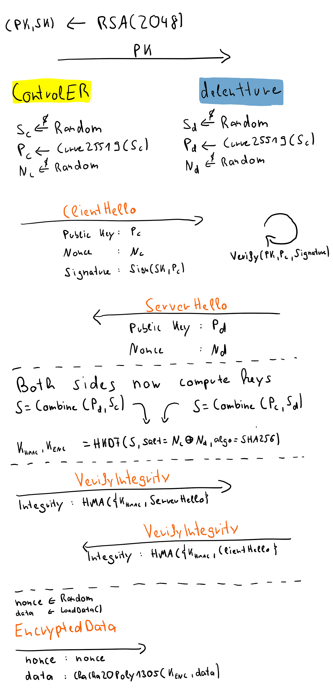

# Assignment 1

## How to set everything up

```bash
cd assignment1
virtualenv super
source ./super/bin/activate
pip install -r requirements.txt
```

This creates a virtual environment and installs the needed python packages. 

## How to execute everything

> Assuming you are still in /assignment1

In the folder `client` is the file `data.csv` that is supposed to be encrypted, send to the server and decrypted. At
the moment, it just contains a test string because the actual data send is to big to be pushed to the repo. Therefore,
exchange the file with `data.csv` (name is hard coded, so please stick to it).

Open one bash terminal and start the server(_delentture_):

```bash
python3 server.py
```

Open one additional terminal and start the client(_controlER_)

```bash
python3 client.py
```

## The Public/Private Key Pair

The Public/Private Key Pair for Server/Client was generated via openSSL. 

```
openssl genrsa -out private.pem 2048 
openssl rsa -in .pem -outform PEM -pubout -out public.pem
```

### Protocol

